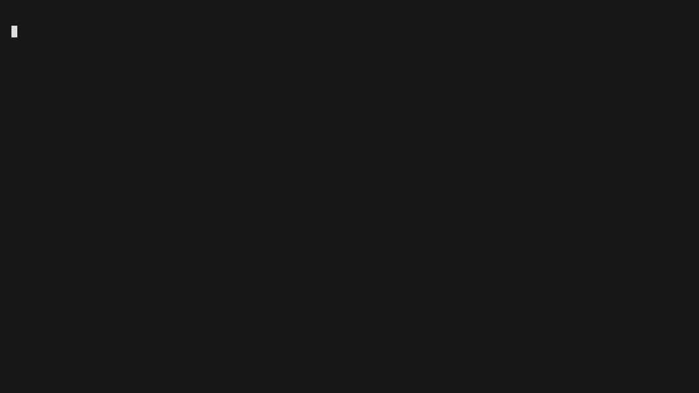

# runkeep

**Archive a GitHub repo's CI history before the Oct 1, 2026 retention change deletes it.**

[](https://github.com/canblmz1/runkeep/actions/workflows/ci.yml)
[](https://pypi.org/project/runkeep/)



<!-- demo.gif is generated from demo.tape by the `demo` workflow (charmbracelet/vhs). -->
<!-- Until it lands, here is the same session as text: -->

```console
$ runkeep check pallets/click

  pallets/click

  total workflow runs   3,661
  older than 90 days    2,680
  oldest run            2025-07-13  (14 months ago)

  2,680 runs are outside the 90-day retention window.
  GitHub starts applying that window to run history on Oct 1, 2026.

  archive it:  runkeep rescue pallets/click

$ runkeep rescue pallets/click --since 2026-08-27 --db click.db

  pallets/click  ->  click.db

  workflow runs     45   (45 hydrated)
  check suites      49
  check runs        276
  legacy statuses   15
  third-party       4 suites, 0 checks
  missing           0

  228 KB written in 6s
  complete - every discovered run and check is archived

$ runkeep verify click.db pallets/click --sample 5

  verify pallets/click  (click.db)

  archive invariant   49/49 suites consistent
  suites vs GitHub    5/5 match
  runs vs GitHub      2/2 match

  OK  (9.1s)
```

## Why

On [2026-08-27 GitHub announced](https://github.blog/changelog/2026-08-27-actions-retention-will-cover-checks-workflow-runs-and-statuses/)
that **starting October 1, 2026, checks, workflow runs, and statuses fall under the Actions
retention setting** — 90 days for public repositories, which cannot be raised. Today that
history sticks around far longer, so a lot of it is about to age out. `runkeep` copies it into
a local SQLite file first, and can keep mirroring new history after that.

## Install

```bash
uvx runkeep check astral-sh/ruff
```

That's the zero-install path — [`uv`](https://docs.astral.sh/uv/) downloads `runkeep`, runs it,
and throws it away. To keep it around:

```bash
pipx install runkeep      # isolated
pip install runkeep       # or just pip
```

Python 3.10+. No dependencies.

## Commands

### `runkeep check OWNER/REPO`

How much CI history the repo is about to lose. Read-only, ~5 seconds, **no token needed for
public repos**.

```
$ runkeep check astral-sh/ruff

  astral-sh/ruff

  total workflow runs   ~150,000
  older than 90 days    ~100,000
  oldest run            2025-07-12  (14 months ago)

  ~100,000 runs are outside the 90-day retention window.
  GitHub starts applying that window to run history on Oct 1, 2026.

  archive it:  runkeep rescue astral-sh/ruff

  counts >= 5,000 are GitHub's live search estimates (they drift a few %).
```

```
$ runkeep check pallets/click

  pallets/click

  total workflow runs   3,661
  older than 90 days    2,680
  oldest run            2025-07-13  (14 months ago)

  2,680 runs are outside the 90-day retention window.
  GitHub starts applying that window to run history on Oct 1, 2026.

  archive it:  runkeep rescue pallets/click
```

### `runkeep rescue OWNER/REPO [--since DATE] [--db FILE]`

Archive the history into SQLite. Discovers every workflow run, hydrates each one's check suite
and check runs, collects legacy commit statuses and independent third-party check suites, and
writes it all to `<repo>.db` (override with `--db`).

- **Resumable.** Interrupt it (Ctrl-C, dropped connection, laptop lid) and run the same command
  again — it reads its own progress out of the SQLite file and continues. Nothing is redone.
- `--since 2026-01-01` bounds the backfill. A bare `runkeep rescue OWNER/REPO` walks the repo's
  entire surviving history.
- Third-party check suites (CodSpeed, Codecov, Renovate, ...) are captured by default; pass
  `--no-thirdparty` to skip them.

```
$ runkeep rescue pallets/click --since 2026-08-20 --db click.db

  pallets/click  ->  click.db

  workflow runs     90   (90 hydrated)
  check suites      97
  check runs        617
  legacy statuses   27
  third-party       7 suites, 0 checks
  missing           0

  428 KB written in 11s
  complete - every discovered run and check is archived
```

Interrupt it and run the same line again:

```
$ runkeep rescue pallets/click --since 2026-08-20 --db click.db

  pallets/click  ->  click.db

  (resumed an earlier run)
  workflow runs     90   (90 hydrated)
  ...
  missing           0

  296 KB written in <1s
  complete - every discovered run and check is archived
```

Needs a token (see [Is this safe?](#is-this-safe)).

### `runkeep verify FILE.db OWNER/REPO`

Re-query GitHub and confirm the archive matches. This is the trust feature: it checks the
whole-archive invariant (every suite's stored check-run count equals its recorded expected
count) and spot-checks a random sample of suites **and** runs against live GitHub through a
*separate* code path — direct REST `filter=all` pagination — so a bug in `rescue` can't hide
behind a matching bug in its own verifier.

```
$ runkeep verify click.db pallets/click

  verify pallets/click  (click.db)

  archive invariant   97/97 suites consistent
  suites vs GitHub    15/15 match
  runs vs GitHub      15/15 match

  OK  (18.3s)
```

## What it saves / what it does not

| Saved (full fidelity) | Not saved |
|---|---|
| Workflow runs — number, attempt, event, status, conclusion, SHA, branch, actor, timestamps, URL | Job **step** details |
| Check suites — status, conclusion, timestamps, commit, branch | Check run **annotations** |
| Check runs — including all attempts (`filter=all`, never `latest`) | Build **logs** |
| App identity — which GitHub App produced each suite | **Artifacts** |
| Legacy commit status contexts — context, state, description, target URL | Per-attempt job timing |
| Independent third-party check suites + their check runs (default-on) | |
| The relationships between all of the above | |

**Logs and artifacts are deliberately out of scope**, and for history old enough to matter
here they are almost always **already deleted at source** (GitHub's existing 90-day
artifact/log window). If you need those, grab them separately while they still exist.

Full detail and how each guarantee is verified: [docs/fidelity.md](docs/fidelity.md).

## Is this safe?

Yes, by construction:

- **Read-only.** Every request is a `GET` or a read-only GraphQL query. `runkeep` never
  issues a mutation and refuses to send any GraphQL document containing `mutation`.
- **Your token is never printed, logged, or written to disk** — not to the SQLite file, not
  to `--json` output, nowhere. It's read from `$GITHUB_TOKEN` (or `$GH_TOKEN`) and used only
  as an `Authorization` header to `api.github.com`.
- **The only host contacted is `api.github.com`.** No telemetry, no analytics, no other
  network egress.
- **The archive is a plain SQLite file you own.** Inspect it with any SQLite tool.

**Token scopes:** `check` needs no token for public repos. `rescue` and `verify` need one:

| Token type | What to grant |
|---|---|
| Fine-grained PAT | Repository access to the target repo, **Actions: Read-only** (and Metadata: Read-only, which is automatic) |
| Classic PAT | `repo` scope (GitHub does not offer a narrower read-only Actions scope on classic tokens) |

## Do I even need this?

Maybe not.

- **Private repositories:** you can raise the Actions retention period up to **400 days** in
  *Settings → Actions → General → Artifact and log retention*
  ([GitHub docs](https://docs.github.com/en/github/administering-a-repository/configuring-the-retention-period-for-github-actions-artifacts-and-logs-in-your-repository)).
  If 400 days is enough for you, do that instead — it's less work and nothing to maintain.
- **Public repositories:** the limit is **90 days and cannot be raised**
  ([org-level docs](https://docs.github.com/en/organizations/managing-organization-settings/configuring-the-retention-period-for-github-actions-artifacts-and-logs-in-your-organization)).
  A local archive is the only option.
- Note that changing the retention setting **only affects new runs**, not history that has
  already aged past the new limit.

`runkeep check` tells you how much is actually at stake for a given repo before you decide.

## Schema

One SQLite file. The tables you'll query:

| Table | One row per | Key columns |
|---|---|---|
| `workflow_run` | workflow run | `database_id`, `node_id`, `run_number`, `run_attempt`, `event`, `status`, `conclusion`, `head_sha`, `head_branch`, `actor_login`, `created_at`, `hydrated` |
| `check_suite` | check suite | `database_id`, `workflow_run_id` (null = third-party), `app_id`, `conclusion`, `head_sha`, `checkrun_total_count`, `checkrun_complete` |
| `check_run` | check run | `database_id`, `check_suite_id`, `name`, `status`, `conclusion`, `started_at`, `completed_at`, `app_slug` |
| `app` | GitHub App | `database_id`, `slug`, `name` |
| `status_context` | (commit, legacy status context) | `commit_sha`, `context`, `state`, `description`, `target_url` |
| `hydration_gap` | anything that couldn't be fully archived | `kind`, `ref`, `detail` — should be empty |
| `discovery_slice` | a fully-collected time window | resume bookkeeping |
| `archive_meta` | key/value | repo, version, last run's API counts |

```sql
-- failure rate by workflow, last 90 days of the archive
SELECT workflow_name,
       count(*)                                             AS runs,
       round(100.0 * sum(conclusion = 'failure') / count(*), 1) AS pct_failed
FROM workflow_run
WHERE created_at > date('now', '-90 days')
GROUP BY workflow_name
ORDER BY runs DESC;
```

```sql
-- the slowest check runs ever recorded
SELECT cr.name,
       r.run_number,
       round((julianday(cr.completed_at) - julianday(cr.started_at)) * 1440, 1) AS minutes
FROM check_run cr
JOIN check_suite s ON s.database_id = cr.check_suite_id
JOIN workflow_run r ON r.database_id = s.workflow_run_id
WHERE cr.completed_at IS NOT NULL AND cr.started_at IS NOT NULL
ORDER BY minutes DESC
LIMIT 20;
```

```sql
-- which non-GitHub-Actions apps post checks on this repo, and how often
SELECT a.slug, a.name, count(*) AS suites
FROM check_suite s
JOIN app a ON a.database_id = s.app_id
WHERE a.slug <> 'github-actions'
GROUP BY a.slug
ORDER BY suites DESC;
```

## License

MIT — see [LICENSE](LICENSE).
